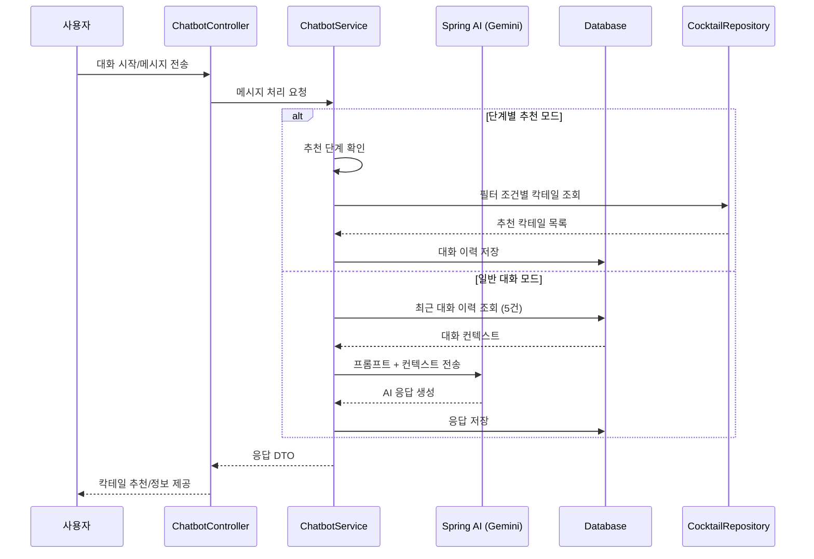
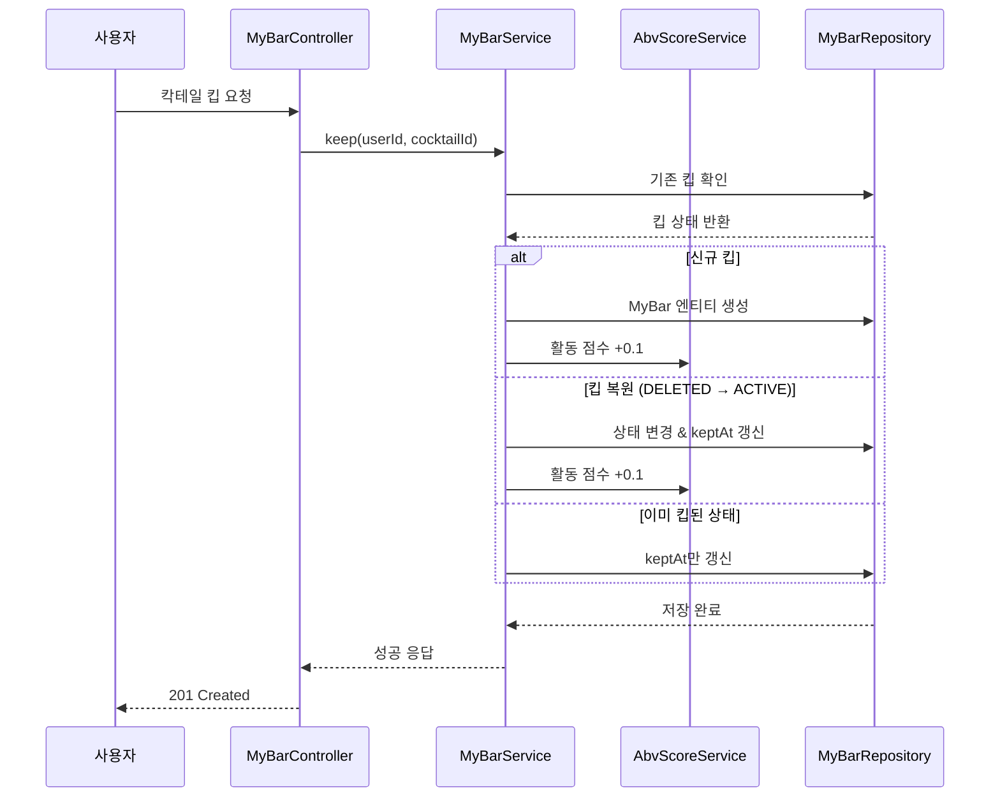
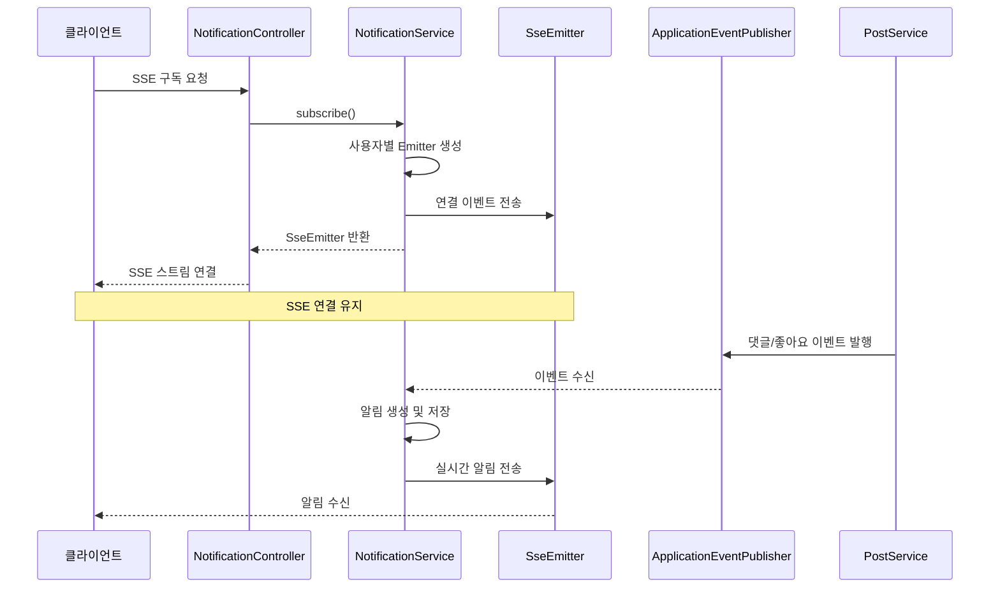

# 🍹 Ssoul - 칵테일 레시피 공유 플랫폼

## 🔗 서비스 링크
**홈페이지**: [https://ssoul.life](https://ssoul.life)

## 📌 개요
본 시스템은 사용자가 칵테일 레시피를 공유하고, AI 바텐더 '쑤리'를 통해 맞춤형 칵테일을 추천받으며, 칵테일 문화를 즐길 수 있는 웹 서비스입니다.
칵테일 입문자부터 애호가까지 모든 사용자를 대상으로, 단순한 레시피 제공을 넘어 AI 챗봇을 통한 인터랙티브한 칵테일 추천과 커뮤니티 기능을 제공합니다.
또한 사용자 활동 기반 등급 시스템(ABV 도수)과 MyBar(킵) 기능을 통해 꾸준한 참여를 유도하도록 설계했습니다.
Spring Boot, Spring AI, OAuth2, SSE, AWS S3 등을 통합해 운영하며,
칵테일 문화 확산과 사용자 간 레시피 공유를 통한 커뮤니티 활성화를 목표로 합니다.

---

## 👥 팀원 및 역할

| 팀원 | 역할 | 담당 업무 |
|------|------|-----------|
| 정용진 | Backend(PM) | AI 챗봇 '쑤리', 단계별 추천 시스템 |
| 이광원 | Backend(팀장) / Frontend | 칵테일 도메인, 검색/필터링, 상세 조회 |
| 석근호 | Backend / Frontend | 커뮤니티(게시판/댓글), S3, 파일 업로드 |
| 최승욱 | Backend / Frontend | 인증/인가, 소셜로그인(OAuth2), JWT, 테라폼 |
| 홍민애 | Backend | MyBar(킵) 기능, 알림 시스템(SSE) |

---

## 🛠 기술 스택
- **Backend**: Java 21, Spring Boot 3.5.5
- **Database**: MySQL 8.x / JPA / H2 (개발)
- **AI 연동**: Spring AI, Gemini API
- **인증**: Spring Security, OAuth2 (Kakao, Google, Naver), JWT
- **파일 저장**: AWS S3
- **실시간 통신**: SSE (Server-Sent Events)
- **캐싱**: Redis
- **API 문서**: Swagger (SpringDoc OpenAPI)

---

## 🔄 핵심 기능 프로세스

### 1️⃣ AI 챗봇 '쑤리' 칵테일 추천 프로세스



### 2️⃣ MyBar (킵) 기능 프로세스



### 3️⃣ 실시간 알림 시스템 (SSE)



## 📂 디렉토리 구조
```plaintext
src
└── main
    ├── java
    │   └── com.back
    │       ├── domain               # 도메인별 핵심 비즈니스 로직
    │       │   ├── user             # 사용자 관련
    │       │   ├── cocktail         # 칵테일 레시피
    │       │   ├── chatbot          # AI 챗봇 '쑤리'
    │       │   ├── mybar            # MyBar (킵) 기능
    │       │   ├── post             # 게시판 관련
    │       │   │   ├── category     # 카테고리
    │       │   │   ├── comment      # 댓글
    │       │   │   └── post         # 게시글
    │       │   └── notification     # 알림 시스템
    │       └── global              # 전역 모듈
    │           ├── ai              # Spring AI 설정
    │           ├── exception        # 예외 처리
    │           ├── file            # 파일 업로드 (S3)
    │           ├── jwt             # JWT 인증
    │           ├── oauth2          # OAuth2 소셜 로그인
    │           ├── rq              # Request 컨텍스트
    │           ├── rsData          # Response 표준화
    │           ├── security        # Spring Security 설정
    │           └── util            # 유틸리티
    └── resources
        ├── prompts                  # AI 프롬프트
        │   ├── chatbot-system-prompt.txt
        │   └── chatbot-response-rules.txt
        ├── application.yml         # 메인 설정
        ├── application-dev.yml     # 개발 환경
        ├── application-prod.yml    # 운영 환경
        └── cocktails.csv           # 칵테일 초기 데이터
```

---

## 🎯 주요 기능

### 1. 칵테일 도메인
- **칵테일 조회**: 무한스크롤 기반 목록 조회
- **상세 정보**: 레시피, 재료, 제조법, 스토리
- **검색/필터링**: 도수, 베이스, 타입별 필터링
- **공유 기능**: 칵테일 레시피 공유 링크 생성

### 2. AI 챗봇 '쑤리'
- **자연어 대화**: 칵테일 관련 질문 응답
- **맞춤 추천**: 기분, 상황, 취향별 칵테일 추천
- **단계별 추천**: 도수 → 베이스 → 스타일 선택
- **대화 컨텍스트**: 최근 5개 대화 기반 응답

### 3. MyBar (킵)
- **칵테일 킵**: 좋아하는 칵테일 저장
- **무한스크롤**: 커서 기반 페이지네이션
- **소프트 삭제**: 킵 해제 후 복원 가능
- **활동 점수**: 킵/언킵 시 ABV 점수 변동

### 4. 커뮤니티
- **게시판**: 카테고리별 게시글 CRUD
- **댓글**: 게시글 댓글 작성/조회
- **좋아요**: 게시글 추천 기능
- **태그**: 해시태그 기반 분류

### 5. 알림 시스템
- **실시간 알림**: SSE 기반 실시간 푸시
- **알림 타입**: 댓글, 좋아요, 팔로우 등
- **읽음 처리**: 알림 확인 후 자동 이동
- **무한스크롤**: 알림 목록 페이지네이션

### 6. 인증/인가
- **소셜 로그인**: Kakao, Google, Naver OAuth2
- **JWT 토큰**: Access/Refresh Token 관리
- **Spring Security**: 권한 기반 접근 제어
- **쿠키 인증**: Secure, HttpOnly, SameSite

---

## 🔐 보안 설정
- **CORS**: 프론트엔드 도메인만 허용
- **JWT**: 15분 Access, 30일 Refresh
- **쿠키**: Secure(HTTPS), HttpOnly, SameSite
- **OAuth2**: 소셜 로그인 프로바이더별 설정
- **예외 처리**: 전역 예외 핸들러

---

## 📈 성능 최적화
- **비동기 처리**: CompletableFuture 활용
- **캐싱**: Redis 세션 스토어
- **커서 페이징**: Offset 대신 커서 기반
- **Lazy Loading**: JPA 지연 로딩
- **인덱싱**: 검색 필드 DB 인덱스

---

## 📊 데이터베이스 스키마


---
